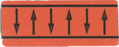
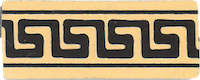
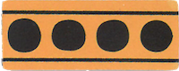
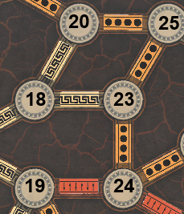
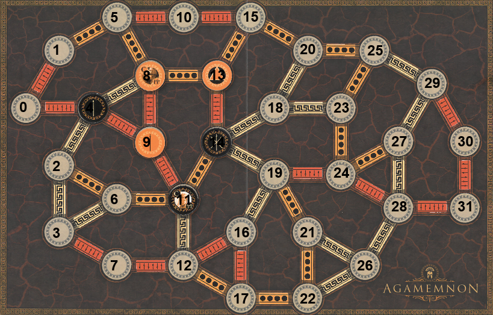

# COMP1140 Assignment 2

## Academic Honesty and Integrity

Honesty and integrity are of utmost importance. These goals are *not* at odds with being resourceful and working collaboratively. You *should* be resourceful, you should collaborate within your team, and you should discuss the assignment and other aspects of the course with others taking the class. However, *you must never misrepresent the work of others as your own*. If you have taken ideas from elsewhere or used code sourced from elsewhere, you must say so with *utmost clarity*. At each stage of the assignment you will be asked to submit a statement of originality, either as a group or as individuals. This statement is the place for you to declare which ideas or code contained in your submission were sourced from elsewhere.

Please read the ANU's [official position](http://academichonesty.anu.edu.au/) on academic honesty. If you have any questions, please ask me.

Carefully review the [statement of originality](originality.md) which you must complete.  Edit that statement and update it as you complete each stage of the assignment, ensuring that when you complete each stage, a truthful statement is committed and pushed to your repo.

## Purpose

In this assignment you will work as a group to master a number of major themes of this course,
including software design and implementation,
using development tools such as Git and IntelliJ, and using JavaFX to build a user interface.
As an extension task, you may also explore strategies for writing agents that play games.
Above all, this assignment will emphasize group work; 
while you will receive an individual mark for your work based on your contributions to the assignment,
you can only succeed if all members contribute to your group's success.

## Assignment Deliverables

The assignment is worth 25% of your total assessment, and it will be marked out of 25.
So each mark in the assignment corresponds to a mark in your final assessment for the course.
Note that for some stages of the assignment you will get a _group_ mark, and for others you will be _individually_ marked.
The mark breakdown and the due dates are described on the [deliverables](https://cs.anu.edu.au/courses/comp1110/assessments/deliverables/) page.

Your work will be marked via your tutor accessing Git, so it is essential that you carefully follow instructions for setting up and maintaining your group repository.
At each deadline you will be marked according to whatever is committed to your repository at the time of the deadline.
You will be assessed on how effectively you use Git as a development tool.

## Problem Description

Your task is to implement in Java, using JavaFX, a board game called [Agamemnon](https://ospreypublishing.com/agamemnon),
designed by Günter Cornett and made by games developer [Osprey Publishing](https://ospreypublishing.com/).
[Board Game Geek provides a description of Agamemnon](https://boardgamegeek.com/boardgame/193693/agamemnon), including images of the components.

### Game Rules 

Agamemnon is a two-player game in which the players compete to win the Trojan War by controlling the *Strings of Fate* that span across the board.
For a complete description, and in case of any ambiguities in the assignment description,
consult the game rules which are distributed with the published game.

#### Strings of Fate

Spaces (nodes) on the board are connected by edges of three different types: *Strength* (red), *Leadership* (white), and *Force* (yellow).
A *String of Fate* is a connected set of edges of the same type.

Strength strings are won by the player with the highest combined strength in tiles on connected nodes.

Leadership strings are won by the player with the highest-ranked Leader tile on any connected node.

Force strings are won by the player with the most tiles on connected nodes.

For example, in the image below, a Force string connects nodes 20, 25, 23, and 24;
a Leadership string connects nodes 20, 18, and 23;
and a Strength string connects nodes 19 and 24.
(Other nodes are also connected, but they can't be seen in this image as it only shows part of the board.)

#### Tiles

There are four types of tiles.

*Warrior* tiles have a strength of one, two, or three; 
each player has three Warrior tiles of strength one ('f'), 
two Warrior tiles of strength two ('g'),
and one Warrior tile of strength three ('h').

Each player has five *Leader* tiles ('a'-'e'), which have both a strength and a rank.
The highest-ranked Leader tile is 'a' and the lowest is 'e'.
When Warrior and Leader tiles are placed, they simply remain in place until the end of the game.

Finally, each player has two *Weft* tiles ('i') and two *Warp* tiles ('j').
Wefts and Warps do not have a strength or leadership rank, but they do count towards force.
When a *Weft* tile is placed, it breaks any Strings of Fate that would have connected through that node,
i.e. the edges on either side of the node are now considered to belong to separate Strings of Fate,
and the Weft is connected to each of the Strings separately.
When a *Warp* tile is placed, the player who placed it chooses two of the neighbouring edges and switches them,
thereby altering the Strings of Fate.

If a player draws a Weft or a Warp tile during their first two turns, 
they may replace it, shuffle their tiles, and choose another tile.

#### Game Play

Players take turns to select tiles and place them on empty spaces on the board.
The players' tiles are placed face down (so they can't be seen) and tiles are randomly selected.
On the first turn, the first player selects a tile and places it on a chosen space on the board.
On subsequent turns, each player randomly selects two tiles and then places them in either order on empty spaces on the board.
On the final turn, the second player places a single tile in one of the remaining empty spaces 
(there will always be two empty spaces remaining on the board at the end of the regular game,
or three empty spaces in the [Loom Variant](#The Loom)).

The game ends when the final tile has been placed, and the score is calculated.
Each String of Fate that is won by a player counts towards that player's score according to the number of edges it contains.
In case of a tie for a String of Fate (for example, both players have the same combined strength on a strength String), neither player receives points for that String.
In the case of a tie for the highest-ranked Leader on a leadership string, the next highest-ranked Leader tiles for each player are compared and so on until a winner is found or there are no more Leader tiles to compare.
The player with the highest score (that is, the highest number of edges controlled) wins the game;
in case of equal scores, the game is declared a tie.

### Encoding Game State

#### Board Edges

The game is played on a board comprised of 32 nodes (33 in the Loom variant), connected by 49 edges (66 for the Loom).
The nodes are numbered starting from zero and in the provided interface are always referred to by number.

*Edges* are specified by their edge type:
 - S = Strength
 - L = Leadership
 - F = Force
 - E = empty (Loom variant only)
 
and by their endpoints in ascending order of node number.
For example, the edge "S0510" is a Strength edge connecting nodes 5 and 10.

The initial connectivity of the standard Agamemnon board is "S0001S0004F0105L0204F0206L0203L0306S0307L0408S0409S0510F0508F0611S0712F0813S0809S0911S1015F1114L1112S1216F1217S1315F1314L1418L1419F1520L1619S1617F1722L1820L1823S1924F1921F2025L2126F2122L2226F2325F2324F2427S2428L2529L2628L2729L2728S2831S2930S3031".

#### Tile Placements

Each player has fifteen pieces, of ten different types.

 - 'a' = Leader, rank = A and strength = 1
 - 'b' = Leader, rank = B and strength = 3
 - 'c' = Leader, rank = C and strength = 4
 - 'd' = Leader, rank = D and strength = 3
 - 'e' = Leader, rank = E and strength = 2
 - 'f' = Warrior of strength 1 (three per player)
 - 'g' = Warrior of strength 2 (two per player)
 - 'h' = Warrior of strength 3
 - 'i' = Weft weaver (two per player)
 - 'j' = Warp weaver (two per player)

A *tile placement* string is four characters in length, 
and is encoded by a single character indicating the player ('O' for the first player, 'B' for the second),
followed by a single character for the tile type, 
followed by two characters for the node.
For example, "Ob10" denotes placement of the first player's 'b' Leader tile on node 10,
whereas "Bg06" denotes placement of one of the second player's Warrior (strength 2) tiles on node 6.

#### Actions

A player's action for each turn is encoded as an *action string*, which is composed of two *sub-actions*.
An *sub-action* is the same as a tile placement for all tile types except Warp tiles.

For a Warp tile, a sub-action is eight characters in length and is encoded by the player identifier, 
followed by the Warp tile type ('J'), 
followed by two characters indicating the node on which the Warp is placed, 
followed by four characters indicating the nodes defining the edges that are to be switched by the Warp tile.
For example, "Oj151020" denotes the first player's placement of a Warp tile at node 15, 
so that the edges connecting to nodes 10 and 20 are switched.

#### Current State

The current game state at any turn is encoded as an array of two strings.
The first string is a concatenation of *tile placements*, and the second is a concatenation of *edges*.
For example, the example game below is encoded by the following state:
{"Of04Bc08Bf09Oc11Oj13Bh14", "S0001S0004F0105L0204F0206L0203L0306S0307L0408S0409S0510F0508F0611S0712F0813S0809S0911S1015F1114L1112S1216F1217F1315S1314L1418L1419F1520L1619S1617F1722L1820L1823S1924F1921F2025L2126F2122L2226F2325F2324F2427S2428L2529L2628L2729L2728S2831S2930S3031"}

Note that the second (edge) state string may change from one turn to the next based on the operation of Warp actions.
However, only the Warp tile placement is included in the first state string, 
so it may not be possible to determine the sequence of actions that led to the current state,
given the state strings alone.

### The Loom

In the Loom variant of the game, there are four different edge types: 'A','B','C','D'.
A custom board is created by choosing a mapping from 'S', 'L' and 'F' to 'A','B','C','D';
the remaining edge type is mapped to 'E' for "Empty".

The full connectivity of the Loom board is:
A0001B0002C0004D0104B0105B0203A0204A0206B0306B0307D0408C0409D0508A0510A0607A0609D0611C0712B0809B0810A0813C0911B0914C1013A1015D1112C1116C1216D1217D1314A1315C1318B1418D1419A1520A1617D1619A1621C1722A1819B1820A1823B1921D1924D2023B2025A2122A2124B2126D2227D2324A2325C2328B2426A2428C2529B2627D2630C2631C2731A2829C2830D2832D2932C3031D3032

and a sample mapping is:
L0001S0002E0004F0104S0105S0203L0204L0206S0306S0307F0408E0409F0508L0510L0607L0609F0611E0712S0809S0810L0813E0911S0914E1013L1015F1112E1116E1216F1217F1314L1315E1318S1418F1419L1520L1617F1619L1621E1722L1819S1820L1823S1921F1924F2023S2025L2122L2124S2126F2227F2324L2325E2328S2426S2428E2529S2627F2630E2631E2731L2829E2830F2832F2932E3031F3032

There are 24 such mappings (24 permutations of the four edge types).
In the Loom variant, a warp tile allows an edge of 'S', 'L', or 'F' type to be swapped with an empty edge.

## Use Your Creativity!

While Günter Cornett's design for the Agamemnon game uses themes from Ancient Greece and the Trojan War, the game itself is entirely abstract.
In other words, you may design entirely different artwork, piece names, and/or story for the game while keeping the gameplay identical.
We encourage you to be as creative as you want in presenting your game; the only requirements are that it should correctly implement the rules of the Agamemnon game, and function according to the provided Java API.

## Legal and Ethical Issues

First, as with any work you do, you must abide by the principles of [honesty and integrity](http://academichonesty.anu.edu.au).
We expect you to demonstrate honesty and integrity in everything you do.

In addition to those ground rules, you are to follow the rules one would normally be subject to in a commercial setting.
In particular, you may make use of the works of others under two fundamental conditions: 
a) your use of their work must be clearly acknowledged, and 
b) your use of their work must be legal (for example, consistent with any copyright and licensing that applies to the given material).
*Please understand that violation of these rules is a very serious offence.* 
However, as long as you abide by these rules, you are explicitly invited to conduct research and make use of a variety of sources.
You are also given an explicit means with which to declare your use of other sources (via originality statements you must complete).
It is important to realize that you will be assessed on the basis of your original contributions to the project.
While you won't be penalized for correctly attributed use of others' ideas, the work of others will not be considered as part of your contribution.
Therefore, these rules allow you to copy another student's work entirely if: 
a) they gave you permission to do so, and 
b) you acknowledged that you had done so.
Notice, however, that if you were to do this you would have no original contribution and so would receive no marks for the assignment (but you would not have broken any rules either).

## Evaluation Criteria

It is essential that you refer to the [deliverables page](https://cs.anu.edu.au/courses/comp1110/assessments/deliverables/) to check that you understand each of the deadlines and what is required.
Your assignment will be marked via tests run through GitLab's continuous integration (CI) framework, so all submittable materials will need to be in your GitLab repository in the *correct* locations, as prescribed by the [deliverables page](https://cs.anu.edu.au/courses/comp1110/assessments/deliverables/).

**The mark breakdown is described on the
[deliverables](https://cs.anu.edu.au/courses/comp1110/assessments/deliverables/) page.**

### Part One

In the first part of the assignment you will:
* Implement parts of the text interface to the game (Tasks #2, and #3).
* Implement a simple viewer that allows you to visualize game states (Task #4).

An indicative grade level for each task for the [completion of part one](https://cs.anu.edu.au/courses/comp1110/assessments/deliverables/#D2C) is as follows:

**Pass**
* Tasks #2 and #3

**Credit**
* Task #4 *(in addition to all tasks required for Pass)*

**Distinction**
* Task #5 and #6 *(in addition to all tasks required for Credit)*

### Part Two

Create a fully working game, using JavaFX to implement a playable graphical version of the game in a 1024x768 window.

Notice that aside from the window size, the details of exactly how the game looks etc, are **intentionally** left up to you.
The diagrams above are for illustration purposes only, although you are welcome to use all of the resources provided in this repo, including the bitmap images.

The only **firm** requirements are that:

* you use Java and JavaFX,
* the game respects the specification of the game given here,
* the game be easy to play,
* it runs in a 1024x768 window, and
* that it is executable on a standard lab machine from a JAR file called `game.jar`,

Your game must successfully run from `game.jar` from within another user's (i.e. your tutor's) account on a standard lab machine (in other words, your game must not depend on features not self-contained within that jar file, the Java 11 runtime and the JavaFX library).

An indicative grade level for each task for the [completion of part two](https://cs.anu.edu.au/courses/comp1110/assessments/deliverables/#D2G) is as follows:

**Pass**
* Correctly implements all of the <b>Part One</b> criteria.
* Appropriate use of git (as demonstrated by the history of your repo).
* Completion of Tasks #7 and #8
* Executable on a standard lab computer from a runnable jar file, game.jar, which resides in the root level of your group repo.

**Credit**
* _All of the Pass-level criteria, plus the following..._
* Task #9

**Distinction**
* _All of the Credit-level criteria, plus the following..._
* Tasks #10 and #11

**High Distinction**
* _All of the Distinction-level criteria, plus the following..._
* Tasks #12 and #13
